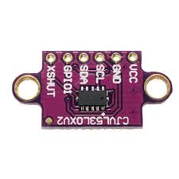

# VL53L0X Time-of-Flight Laser Ranging Sensor

Code for getting started with a VL53L0X ToF (Time-of-Flight) Laser Ranging sensor.

The VL53L0X sensor uses a small laser and a matching detector sensor. The VL53L0X detects how long it takes the laser light to bounce off a surface back to the sensor. Since it is using a very narrow light source, it only detects the distance of surfaces directly in front of the sensor.

The VL53L0X uses the I2C serial protocol.

 

## Boards

Setup instructions and starter code for different development boards

| Board | Folder |
| --- | --- |
<!-- | Arduino Uno | [arduino-uno/](arduino-uno/) |
| Arduino MKR WiFi 1010 | For MKR WiFi 1010 follow instructions for Arduino Uno [arduino-uno/](arduino-uno/) |
| Arduino Nano 33 BLE | For Nano 33 BLE follow instructions for Arduino Uno [arduino-uno/](arduino-uno/) |
| ESP32 | For ESP32 boards, follow instructions for ESP8266 [esp8266/](esp8266/) |
| ESP8266 | [esp8266/](esp8266/) | -->
| Jetson Nano | For Jetson Nano, follow instructions for Raspberry Pi [raspberry-pi/](raspberry-pi/) |
| Raspberry Pi | [raspberry-pi/](raspberry-pi/) |
|  |  |

 

## Other Files and Folders

| File/Folder | Description |
|--- | --- |
<!-- | additional-libraries | Folder contains libraries needed for Arduino sketches. They are included as submodules. Use either `git clone --recursive` or `git submodule init` after cloning. | -->
| [docs/vl53l0x.pdf](docs/vl53l0x.pdf) | Data sheet for sensor |
|  |  |

 

## Branches

**main**: main branch. currently not using other branches.

 

## References

- Manufacturer: https://www.st.com/en/imaging-and-photonics-solutions/vl53l0x.html
- Datasheet: https://www.st.com/resource/en/datasheet/vl53l0x.pdf 
