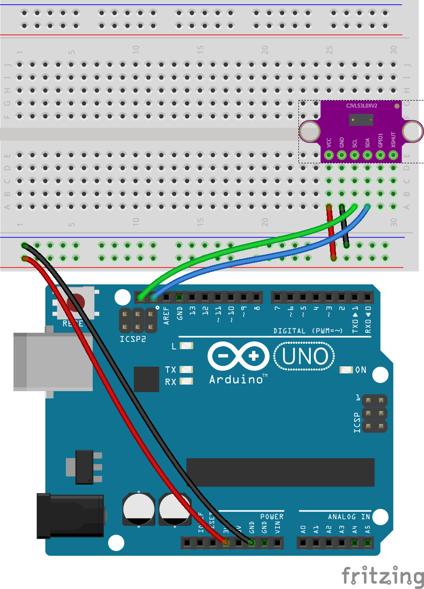

# Arduino Uno and VL53L0X Time-of-Flight Laser Ranging Sensor

Setup instructions and starter code for using the VL53L0X Time-of-Flight Laser Ranging sensor and an Arduino development board.

 

## Files and Folders

| File/Folder | Description |
|--- | --- |
| [arduino/](arduino/) | Arduino projects folder |
| [arduino/vl53l0x-distance-sensor/vl53l0x-distance-sensor.ino](arduino/vl53l0x-distance-sensor/vl53l0x-distance-sensor.ino) | Simple arduino sketch. |
| [mkr-wifi-1010-setup.md](mkr-wifi-1010-setup.md) | Setup instructions for using an Arduino MKR WiFi 1010 dev board. |
|  |  |

 

## Setup

Setup instructions for an Arduino Uno board is below. For MKR WiFi 1010 based setup instructions see [mkr-wifi-1010-setup.md](mkr-wifi-1010-setup.md).

## Circuit Diagram
Wire the components as shown in the diagram.

<!-- #TODO schematic diagram -->
<!--  -->

#### Components Needed

* VL53l0X Sensor
* connecting wires
* arduino uno development board

 

 

### Default Pin Wiring

| Pin No | Function | Device Connection |
| --- | --- | --- |
| 3V | +3.3V | Vcc |
| GND | GND | GND |
| 18 | SDA | SDA |
| 19 | SCL | SCL |
|  |  |  |

 

## Arduino

The sketch will work with many different types and chipset of board. To use an Arduino Uno, make sure to select the correct board in Boards Manager.

The arduino sketches require the Adafruit VL53L0X library. It is included in the root additional-libraries folder. Afternatively, it can be downloaded through the Arduino libraries manager or from https://github.com/adafruit/Adafruit_VL53L0X

## References

- https://www.arduino.cc/en/reference/board
- https://github.com/adafruit/Adafruit_VL53L0X