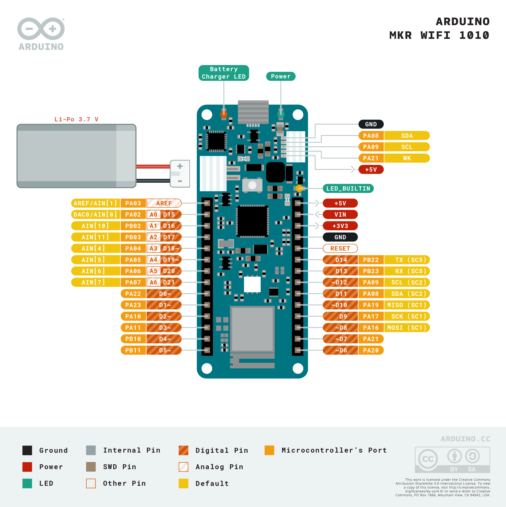

# Setup for MKR WiFi 1010 dev board

<!-- #TODO add circuit diagrams and library info -->
Setup instructions for an Arduino MKR WiFi 1010 development board.

## Circuit Diagram
Wire the components as shown in the diagram.

#### Components Needed
* 
* connecting wires
* MKR WiFi 1010 development board

 

 

### Default Pin Wiring

| Pin No | Function | Device Connection |
| --- | --- | --- |
|  |  |  |
| VCC | +3.3V | Vdd |
| GND | GND | GND |
|  |  |  |

 

## Arduino

Drivers and board details need to be installed to use the Arduino MKR series. Follow the instructions here: https://www.arduino.cc/en/Guide/MKRWiFi1010#toc2

The arduino sketch requires the .. libraries. They are included in the libraries folder.
