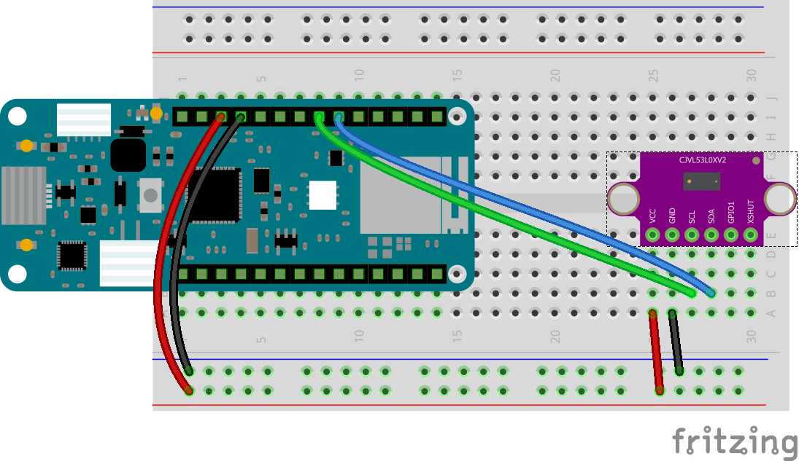

# Setup for MKR WiFi 1010 dev board

Setup instructions for an Arduino MKR WiFi 1010 development board.

## Circuit Diagram
Wire the components as shown in the diagram.

<!-- #TODO schematic diagram -->
<!--  -->

#### Components Needed

* VL53l0X Sensor
* connecting wires
* MKR WiFi 1010 development board

 

 

### Default Pin Wiring

| Pin No | Function | Device Connection |
| --- | --- | --- |
|  |  |  |
| VCC | +3.3V | Vdd |
| GND | GND | GND |
| 11 | SDA | SDA |
| 12 | SCL | SCL |
|  |  |  |

 

## Arduino

Drivers and board details need to be installed to use the Arduino MKR series. Follow the instructions here: https://www.arduino.cc/en/Guide/MKRWiFi1010#toc2

The arduino sketches require the Adafruit VL53L0X library. It is included in the root additional-libraries folder. Afternatively, it can be downloaded through the Arduino libraries manager or from https://github.com/adafruit/Adafruit_VL53L0X
