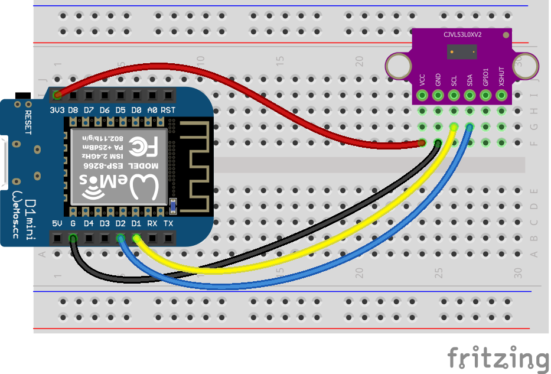

# ESP8266 and VL53L0X Time-of-Flight Laser Ranging Sensor

Code for getting started with VL53L0X Time-of-Flight Laser Ranging sensor and an ESP8266 development board.

 

## Files and Folders

| File/Folder | Description |
|--- | --- |
| [../arduino-uno/arduino/](arduino/) | For Arduino, use the sketches in the Arduino Uno folder [../arduino-uno/arduino](../arduino-uno/arduino) |
| [micropython/](micropython/) | folder for micropython scripts. Pymakr is configured to sync this folder with the micropython device. |
| [micropython/distance_readings.py](micropython/distance_readings.py) | micropython script that reads the distance values and prints them to the repl. |
|  |  |

 

## Setup

Setup instructions for a WeMos D1 mini are below. For ESP32 based setup instructions see [esp32-setup.md](esp32-setup.md).

## Circuit Diagram

Wire the components as shown in the diagram.

<!-- #TODO schematic diagram -->
<!--  -->

#### Components Needed

* VL53l0X Sensor
* connecting wires
* esp8266 device

 

 

### Default Pin Wiring

| Pin No | Function |  | Device Connection |
| --- | --- | --- | --- |
| 3V3 | 3.3V |  | VL53L0X VCC 3.3V |
| D2 | GPIO 4 (SDA) |  | VL53L0X SDA (I2C) |
| D1 | GPIO 5 (SCL) |  | VL53L0X SCL (I2C) |
| G | GND |  | GND |
|  |  |  |  |

Further details and other board pin out diagrams can be found here: https://randomnerdtutorials.com/esp8266-pinout-reference-gpios/

 

## Arduino

The sketch will work with many different types and chipset of board. To use an ESP8266 board with Arduino IDE, you will need to install the relevant board configuration files. Follow the instructions here: https://arduino-esp8266.readthedocs.io/en/latest/installing.html

The arduino sketches require the Adafruit VL53L0X library. It is included in the root additional-libraries folder. Afternatively, it can be downloaded through the Arduino libraries manager or from https://github.com/adafruit/Adafruit_VL53L0X

 

## MicroPython

The MicroPython script uses a module from https://bitbucket.org/thesheep/micropython-vl53l0x. It is included in the [micropython/lib](micropython/lib) folder.

 

## References

- https://randomnerdtutorials.com/esp8266-pinout-reference-gpios/
- Arduino library: https://github.com/adafruit/Adafruit_VL53L0X
- Micropython library: https://bitbucket.org/thesheep/micropython-vl53l0x
