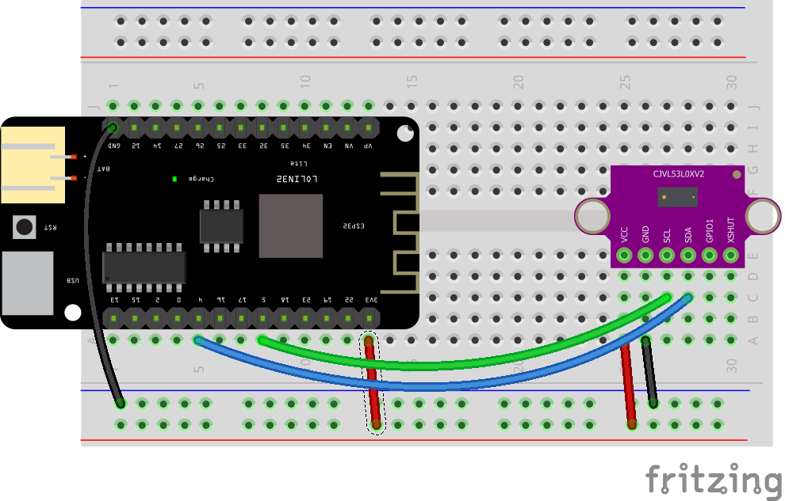

# Setup for ESP32 dev board

Setup instructions for an ESP32 based development board, like the Lolin D32 or Lolin32 Lite.

## Circuit Diagram
Wire the components as shown in the diagram.

<!-- #TODO schematic diagram -->
<!--  -->

#### Components Needed

* VL53l0X Sensor
* connecting wires
* esp32 development board

 

 

### Default Pin Wiring

| Pin No | Function | Device Connection |
| --- | --- | --- |
|  |  |  |
|  | +3.3V | Vcc |
|  | GND | GND |
| 4 | GPIO4 |  | SDA |
| 5 | GPIO5 |  | SCL |
|  |  |  |

Further details and other board pin out diagrams can be found here: https://randomnerdtutorials.com/esp32-pinout-reference-gpios/

 

## Arduino

The sketch will work with many different types and chipset of board. To use an ESP32 board with Arduino, you will need to install the relevant board configuration files. Follow the instructions here: https://github.com/espressif/arduino-esp32/blob/master/docs/arduino-ide/boards_manager.md

<!-- #TODO add library info -->
The arduino sketch requires the -- library. It is included in the libraries folder.

 

## MicroPython

The MicroPython script uses a module from https://bitbucket.org/thesheep/micropython-vl53l0x. It is included in the [micropython/lib](micropython/lib) folder.

 

## References

- https://randomnerdtutorials.com/esp32-pinout-reference-gpios/
- Micropython library: https://bitbucket.org/thesheep/micropython-vl53l0x
