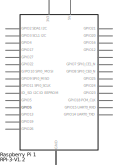
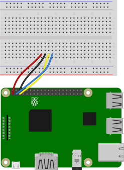

# Raspberry Pi and -- Sensor

<!-- #TODO add sensor and circuit diagrams -->
Code for getting started with ... sensor using a Raspberry Pi.

<br />

## Files and Folders

| File/Folder | Description |
|--- | --- |
| [python/](python/) | folder for python scripts. |
| [python/requirements.txt](python/requirements.txt) | Requirements file for python dependancy libraries. |
| [config.sh](config.sh) | Bash script to automatically configure and setup the Raspberry Pi for using the ... sensor. |
|  |  |

<br />

## Circuit Diagram

Wire the components as shown in the diagram.



#### Components Needed

* 
* connecting wires
* raspberry pi

<br />



<br />

### Default Pin Wiring

| Pin No | Function |  | Device Connection |
| --- | --- | --- | --- |
|  |  |  |  |
| 1 | +3.3V |  | Vdd |
| 6 | GND |  | GND |
|  |  |  |  |


<br />

## Configure Raspberry Pi

The Raspberry Pi needs to have the I2C interface enabled and dependancy libraries need to be installed. Either follow the instructions below or run the config.sh script to automatically setup the Raspberry Pi.

```bash
chmod +x config.sh
./config.sh
```

### Enable I2C interface

I2C needs to be enabled on the Raspberry Pi in order to read data from the sensor.

Open the raspi-config tool, found in preferences, or type the following in a terminal.

```bash
sudo raspi-config
```

Under interfaces, enable I2C interface. Click ok and reboot.

Check that the device is communicating properly. In a terminal, type `sudo i2cdetect -y 1`.

```bash
pi@raspberrypi:~ $ sudo i2cdetect -y 1
     0  1  2  3  4  5  6  7  8  9  a  b  c  d  e  f
00:          -- -- -- -- -- -- -- -- -- -- -- -- --
10: -- -- -- -- -- -- -- -- -- -- -- -- -- -- -- --
20: -- -- -- 23 -- -- -- -- -- -- -- -- -- -- -- --
30: -- -- -- -- -- -- -- -- -- -- -- -- -- -- -- --
40: -- -- -- -- -- -- -- -- -- -- -- -- -- -- -- --
50: -- -- -- -- -- -- -- -- -- -- -- -- -- -- -- --
60: -- -- -- -- -- -- -- -- -- -- -- -- -- -- -- --
70: -- -- -- -- -- -- -- --
```

The default address for the sensor is 0x23. The other address is 0x5C using the address pin.

### Python Dependancies

The python script requires the PyPi ... library from https://pypi.org/project/.../. This library can be installed from PyPI by executing:

```bash
sudo pip install ...
```

A requirements.txt file is also provided and can be used instead.
```bash
cd ./python
sudo pip install -r requirements.txt
```

<br />

## References

- 
