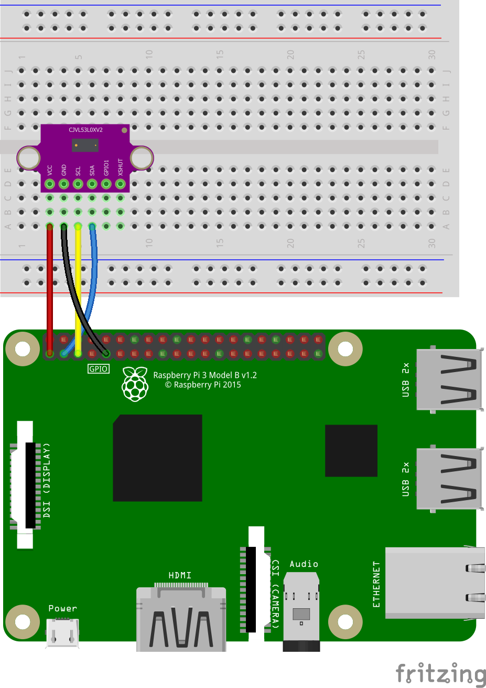

# Raspberry Pi and VL53L0X Time-of-Flight Laser Ranging Sensor

Code for getting started with VL53L0X Time-of-Flight Laser Ranging sensor using a Raspberry Pi.

<br />

## Files and Folders

| File/Folder | Description |
|--- | --- |
| [python/](python/) | folder for python scripts. |
| [python/requirements.txt](python/requirements.txt) | Requirements file for python dependancy libraries. |
| [python/VL53L0XRangeReading.py](python/VL53L0XRangeReading.py) | Python script that reads distance measurements. |
| [config.sh](config.sh) | Bash script to automatically configure and setup the Raspberry Pi for using the ... sensor. |
|  |  |

<br />

## Circuit Diagram

Wire the components as shown in the diagram.

<!-- #TODO schematic diagram -->
<!--  -->

#### Components Needed

* VL53L0X Time-of-Flight Laser Ranging Sensor breackout board
* connecting wires
* raspberry pi

<br />



<br />

### Default Pin Wiring

| Pin No | Function |  | Device Connection |
| --- | --- | --- | --- |
|  |  |  |  |
| 1 | +3.3V |  | VCC |
| 6 | GND |  | GND |
| 3 | GPIO2 / I2C1 SDA |  | SDA |
| 5 | GPIO3 / I2C1 SCL |  | SCL |
|  |  |  |  |


<br />

## Configure Raspberry Pi

The Raspberry Pi needs to have the I2C interface enabled and dependancy libraries need to be installed. Either follow the instructions below or run the config.sh script to automatically setup the Raspberry Pi.

```bash
chmod +x config.sh
./config.sh
```

### Enable I2C interface

I2C needs to be enabled on the Raspberry Pi in order to read data from the sensor.

Open the raspi-config tool, found in preferences, or type the following in a terminal.

```bash
sudo raspi-config
```

Under interfaces, enable I2C interface. Click ok and reboot.

Check that the device is communicating properly. In a terminal, type `sudo i2cdetect -y 1`.

```bash
pi@raspberrypi:~ $ sudo i2cdetect -y 1
     0  1  2  3  4  5  6  7  8  9  a  b  c  d  e  f
00:          -- -- -- -- -- -- -- -- -- -- -- -- --
10: -- -- -- -- -- -- -- -- -- -- -- -- -- -- -- --
20: -- -- -- -- -- -- -- -- -- 29 -- -- -- -- -- --
30: -- -- -- -- -- -- -- -- -- -- -- -- -- -- -- --
40: -- -- -- -- -- -- -- -- -- -- -- -- -- -- -- --
50: -- -- -- -- -- -- -- -- -- -- -- -- -- -- -- --
60: -- -- -- -- -- -- -- -- -- -- -- -- -- -- -- --
70: -- -- -- -- -- -- -- --
```

The default address for the sensor is 0x29. The address can be changed to 0x30 by programmatically changing registers in the sensor.

### Python Dependancies

The python script requires a VL53L0X.py library from
https://github.com/pimoroni/VL53L0X_python/. For python2 or python 3.4, or 3.5 this can be installed from PyPi by executing:

```bash
sudo pip install VL53L0X
```

A requirements.txt file is also provided and can be used instead.
```bash
cd ./python
sudo pip install -r requirements.txt
```

For python 3.6 or higher, this has to be installed from source:
```bash
sudo pip3 install git+https://github.com/pimoroni/VL53L0X_rasp_python.git
```
[note: URL is correct]

<br />

## References

- Python library: https://pypi.org/project/VL53L0X/
- Python library: https://github.com/pimoroni/VL53L0X-python
